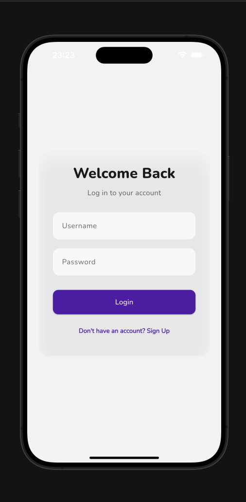

# HireOrbit — Internship & Job Application Tracker
check out https://hireorbit-52d04.firebaseapp.com/
HireOrbit is your personal assistant for managing all your internship and job applications in one organized place.  
It’s built with **Spring Boot**,**Spring Security** ,**JWT authentication**, **Flutter UI**, and a clean backend–frontend separation.

---

##  Why I Built This

A few months ago, I actually forgot to apply for **three** companies during my on-campus placement drive — simply because I lost track of deadlines and didn’t have a clear overview.  
That small mistake cost me real opportunities, and it made me realize how easy it is to get overwhelmed when you’re juggling multiple applications, interviews, and follow-ups.

So, I built **HireOrbit** for myself — to **never miss a deadline again**, to **track every application**, and to feel more **in control** of my job hunt.  
Along the way, I learned to build secure REST APIs with **Spring Boot**, implement **JWT authentication**, and design a modern, glassmorphic Flutter interface.

If HireOrbit helps even one student avoid missing out on their dream role, it’s worth it.

---

## Tech Stack

- **Backend:** Spring Boot, Spring Security, JWT, BCrypt encryption
- **Frontend:** Flutter (cross-platform), modern glassmorphic design
- **Database:** MySQL
- **Hosting:** Render
- **State Management:** Provider (Flutter)

---

## Features

-  **Secure Authentication:** Register and log in with JWT
-  **Job CRUD:** Add, edit, delete job applications
-  **Track Deadlines:** See upcoming deadlines at a glance
-  **Status Filters:** Filter by application status
-  **Clean UI:** Modern glassmorphic design

---

##  New Feature: Smart Email Notifications (Added on August 6, 2025)

We've added a **fully-automated email reminder system** so you never miss deadlines again!

### What’s New:

- **Daily Reminder Emails**:  
  Sent **every morning** for jobs that have an upcoming deadline.  
  > _“The deadline for the job at Amazon for the profile of SDE is on 08 August 2025.”_

- **Final Day Alerts**:  
  If it’s the last day, you’ll receive emails **every 6 hours** until the deadline.

- **No Deadline? No Problem**:  
  If a job doesn't have a deadline, you'll still get a **confirmation email** when you add it — but no repeated reminders.

- **Status Change Notifications**:  
  Every time you update the status of a job (e.g. from "Applied" to "Interviewing"), HireOrbit automatically sends you an update email:
  > _“The status for your application at Google for SDE has been updated to ‘Interviewing’.”_

### How It Works

- Uses Spring Boot’s `@Scheduled` tasks to check for deadlines every day/hour.
- All emails are sent via `JavaMailSender`.
- You just need to **add your email once** after login to start receiving updates!

---

## Screenshots

| Splash Screen | Sign Up | Login |
|---------------|---------|-------|
|  |  |  |

| Home | Add Job | Enter Email |
|------|---------|----------|
|  |  |  | 

| Deadline Email | Status Updated Email | Job added Email |
|----------------|-----------------------|----------|
|  |  | |

---

## Getting Started

### 1️⃣ Clone the repo

```bash
git clone https://github.com/SONISOMYA/HIREORBIT.git
cd HIREORBIT
git clone https://github.com/<your-username>/HireOrbit.git
cd HireOrbit
```
### 2️⃣ Backend
```bash
cd backend
./mvnw spring-boot:run
```
### 3️⃣ Frontend
```bash
cd frontend
flutter pub get
flutter run
```
Star ⭐ this repo if you find it useful!
