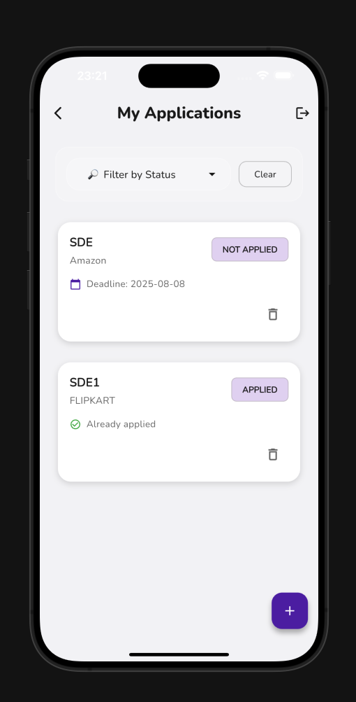
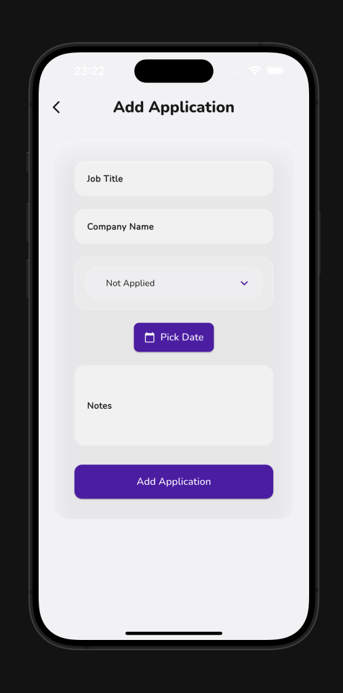

#  HireOrbit — Internship & Job Application Tracker

HireOrbit is your personal assistant for managing all your internship and job applications in one organized place.  
It’s built with **Spring Boot**, **JWT authentication**, **Flutter UI**, and a clean backend–frontend separation.

---

## Why I Built This

A few months ago, I actually forgot to apply for **three** companies during my on-campus placement drive — simply because I lost track of deadlines and didn’t have a clear overview.  
That small mistake cost me real opportunities, and it made me realize how easy it is to get overwhelmed when you’re juggling multiple applications, interviews, and follow-ups.

So, I built **HireOrbit** for myself — to **never miss a deadline again**, to **track every application**, and to feel more **in control** of my job hunt.  
Along the way, I learned to build secure REST APIs with **Spring Boot**, implement **JWT authentication**, and design a modern, glassmorphic Flutter interface.

If HireOrbit helps even one student avoid missing out on their dream role, it’s worth it. 😊

---

## Tech Stack

- **Backend:** Spring Boot, Spring Security, JWT,BCrypt encryption
- **Frontend:** Flutter (cross-platform), modern glassmorphic design
- **Database:** MySQL
- **Hosting:** Render 
- **State Management:** Provider (Flutter)

---

## ✅ Features

- 🔐 **Secure Authentication:** Register and log in with JWT.
- 📄 **Job CRUD:** Add, edit, delete job applications.
- 📅 **Track Deadlines:** See upcoming deadlines at a glance.
- 🗂️ **Status Filters:** Filter by application status.
- 🌙 **Clean UI:** Modern glassmorphic design.


## **Screenshots**

| Splash Screen | Sign Up | Login |
|---------------|---------|-------|
|  |  |  |

| Home | Add Job | Job Card |
|------|---------|----------|
|  |  |  |


## **Getting Started**

###  1️⃣ Clone the repo
```bash
git clone https://github.com/<your-username>/HireOrbit.git
cd HireOrbit
```
### 2️⃣ Backend
```bash
cd backend
./mvnw spring-boot:run
```
###3️⃣ Frontend
```bash
cd frontend
flutter pub get
flutter run
```
Star ⭐ this repo if you find it useful!
